
# Setup a Linux (Ubuntu) Environment
In this lab, we will go through the steps to setup a virtual machine (VM) on your own computer. This allows you to work in a Linux environment, regardless of the operating system (OS) running on your computer. We called the OS running on your computer the *host OS*, and the OS running in an VM the *guest OS*. Also, we include some basics of Linux and VirtualBox, which hopefully prepare you to work in a Linux environment.

## Content
1. [Start a Linux VM (using VirtualBox)](#vbox)
   - [Setup](#setup)
   - [Login](#login)
   - [Poweroff/Reboot](#poweroff)
   - [Host key of VirtualBox](#control)
2. [Using a Terminal in Linux](#terminal)
   - [Open/Close a Terminal](#openclose)
   - [File Management](#file)
   - [File Editing](#editing)
   - [The *root* user](#root)
   - [File Transfter](#transfer)
   - [Package Installation](#package)
   - [Command Manual](#manpage)
3. [More about VirtualBox](#morevbox)
4. [References](#ref)

## Start a Linux VM

### 1. Obtain VirtualBox
VirtualBox is one of the software for VM hosting. It runs on Mac OS, Windows, and Linux, and is freely available on its official website, https://www.virtualbox.org/wiki/Downloads. You may download an installer of the latest version, according to your computer's OS.

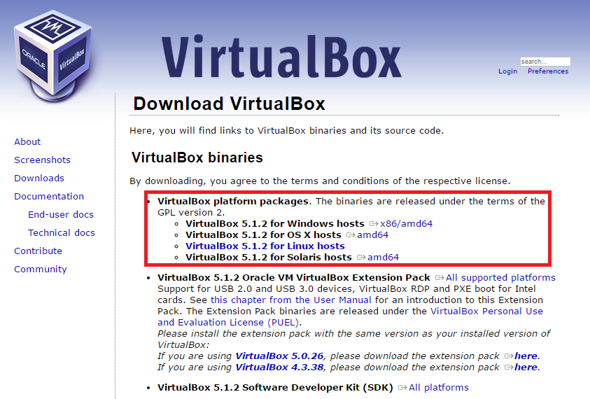

After downloading the installer, open it to install VirtualBox and use the default configurations, i.e., all you need to do is to click "Next" to proceed and "Yes" for prompts asking for permissions to modify computer's settings until the installation completes.

### 2. Obtain the VirtualBox machine image
Download the machine image for our course, which is a clean installation of 32-bit Ubuntu Trusty Desktop. The image, named "csci3150-ubuntu.ova", can be obtained [here](https://goo.gl/he6ISS).

The settings of the VM:
- OS: Ubuntu 14.04 LTS (32-bit)
- CPU: 1
- Memory: 1 GB
- Disk: 16 GB
- GCC: 4.8.4

### 3. Import the machine image
Open VirtualBox,

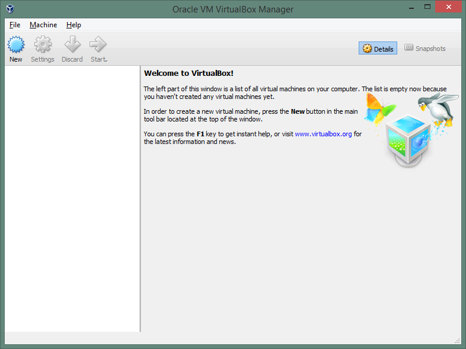

Select "File" > "Import Appliance ...".

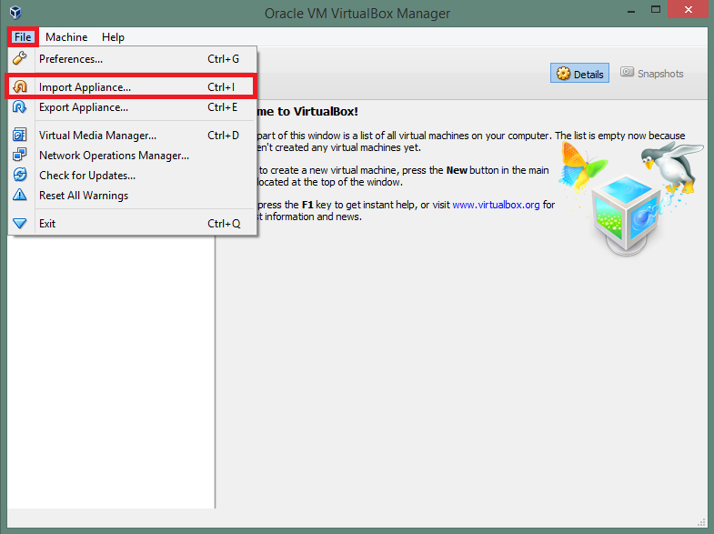

Locate the machine image and click "Next".

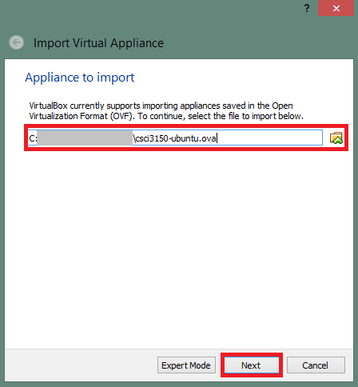

Keep the machine settings and click "Import".

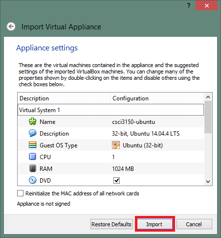

Wait until the machine import completes and the machine will be listed in the VM manager.

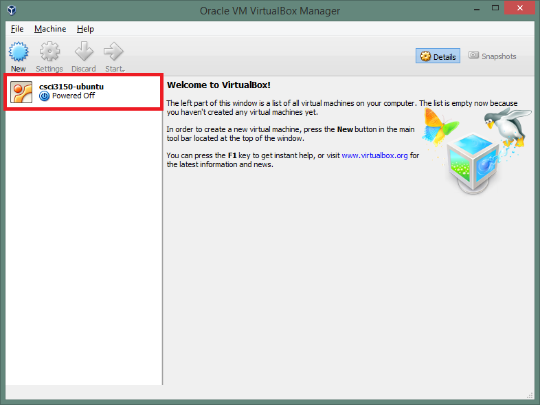

**Make sure the network cable is connected by default:**

Select the VM and click "Settings"

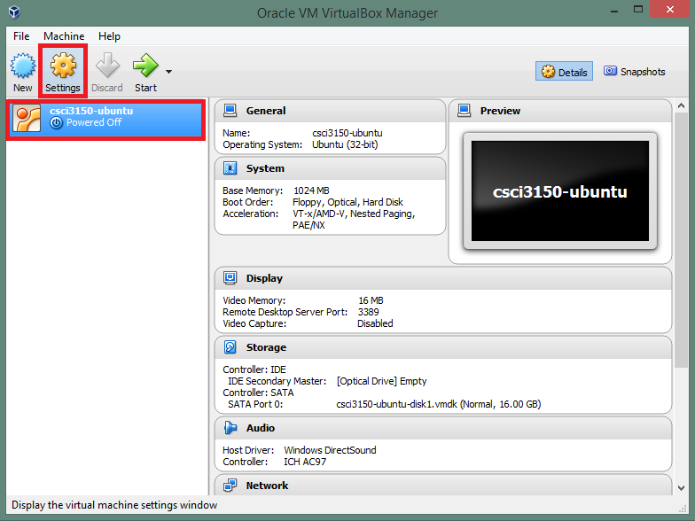

 Choose "Network" > "Adapter 1" and check "Cable Connected"

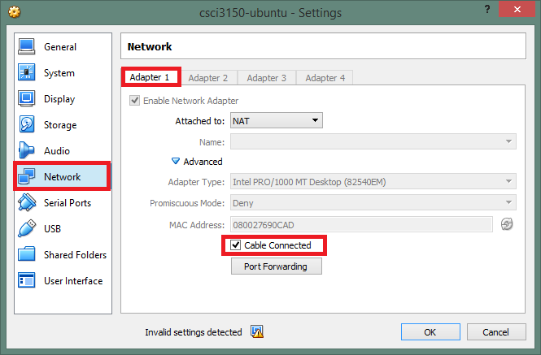

### 4. Run the machine
#### Power up the machine
Select the VM, click "Start", and a new window pops out which shows the console of the VM.

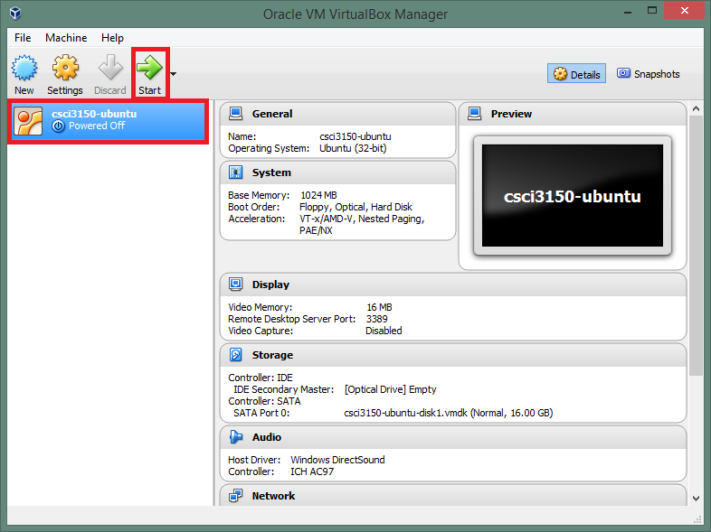

[Back to Top](#top)

#### Login
Wait while the machine and OS boots, until you see the login screen below. **You may then login using the default username "csci3150", with password "csci3150".**

After login, you will see a desktop, with the system bar on the left (in contrast to that at the bottom for Windows and Mac OS).

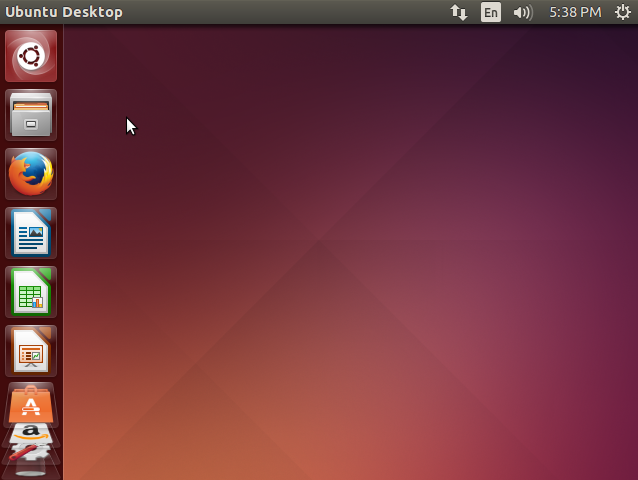

And now we have finished setting up a VM running Linux.

[Back to Top](#top)

#### Power off the machine
You may normally shutdown the machine in the OS, by clicking the "wheel" icon on the top right-hand corner and select "Shut Down ..." at the bottom of the list.

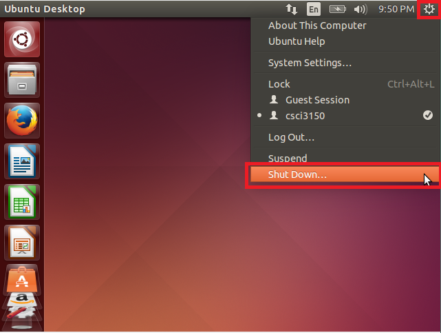

Select "Shutdown" on the right in the prompt.

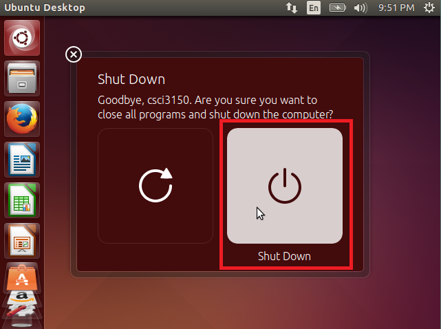

The windows showing the console of VM will then close.

If you want to reboot your VM instead of shutting down, choose "Restart" on the left.

When it is impossible to shut down from OS, e.g. OS becomes unresponsive, you may force the VM to shutdown from VirtualBox as follows:

Select "File" > "Close".

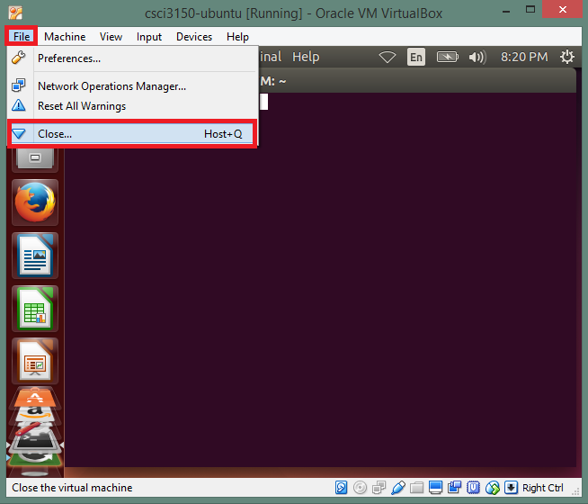

Select "Power off the machine" > "OK".

[Back to Top](#top)

### Host key of VirtualBox (Important!!)
VirtualBox uses the right "Ctrl" key as the *Host key* by default, as shown at the bottom right-hand corner of the VM's window. By pressing the "Host key", you may attach/detach your input devices to/from the VM. **When you intend to press/issue "Ctrl" inside the VM, use the left "Ctrl" instead of the right one to avoid confusion.**

[Back to Top](#top)

## Using a Terminal in Linux
While most tasks can be done via the graphic user interface (GUI), it is important to learn how tasks can be performed using commands via a terminal in this OS course. Here we will try some basic examples.

### Open a terminal
A terminal can be opened via searching.

Click the top-most icon in the system bar and enter "terminal" in the search bar.

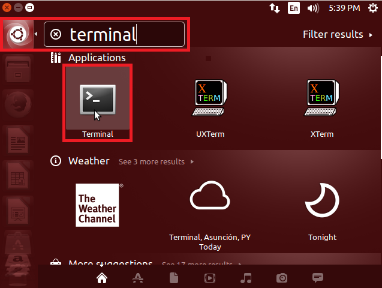

Other than searching, you may use the shortcut "Ctrl"+"Alt"+"t".

Here is a terminal window:

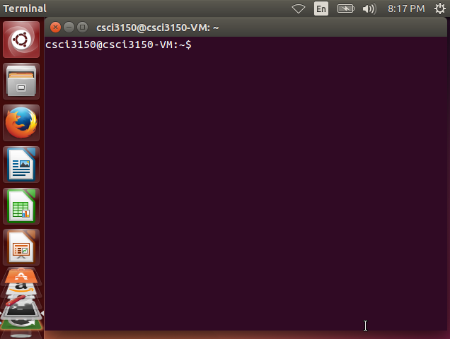

Note that the prompt `csci3150@csci3150-VM:~$` is in form of `[user]@[hostname]:~$`. **The examples of commands afterwards always start with the `$` that corresponds to that at the end of this prompt.**

### Close a terminal
A terminal can be closed by
- Clicking the "x" button on the top left-hand corner of the terminal, or
- Typing "exit" and then pressing "Enter" in the terminal, or
- Pressing "Ctrl"+"d"

[Back to Top](#top)

### File management
Here are some examples on basic file management.

(Note that the commands are in one single line, i.e. don't break them into multiple lines!)

- Create directory, e.g. create a directory named "mydir": `$ mkdir mydir`
- List files, e.g. in the directory "mydir": `$ ls mydir`
- Create an empty file, e.g. create a file named "myfile": `$ touch myfile`
- Copy files, e.g. copy a file named "myfile" as "myfile_copy": `$ cp myfile myfile_copy`
- Move files, e.g. move a file named "myfile_copy" into directory "mydir": `$ mv myfile_copy mydir/myfile_copy`
- Rename files, e.g. rename a file named "myfile" into "myfile1": `$ mv myfile myfile1`
- Remove files (use with caution!!), e.g. remove a file named "myfile1": `$ rm myfile1`

[Back to Top](#top)

### File editing
#### Text-based editor
Here are two commonly used text editors.
- `nano` / `pico`, is an intuitive, i.e. less complex, text editor. The most commonly used commands, like "Exit" ("Ctrl"+"x"), are listed at the bottom of the editor. To start editing a file, e.g. named as "myfile.txt", just type `$ nano myfile.txt` in the terminal.

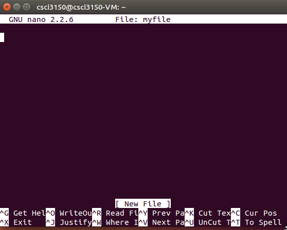

- `vim` (http://www.vim.org), is a more-advanced and powerful, yet more complex, text editor. It takes time to get familiar with the controls, hence you are recommended to learn it in your spare time. `vim` is not pre-installed (but `vi`), and you may install it by following the example in the "Package installation" section.

[Back to Top](#top)

### The most powerful user, "*root*"
There is always an ultimate user "*root*" in Linux, who has the right to do everything. Since the password is not yet set for "root", it is impossible to login in as root. However, a *"sudoer"* user, which is "csci3150" in our case, may upgrade herself to "root" via the command `sudo`: execute `$ sudo su` followed by entering the password of "csci3150". Note that the ending character of the command prompt changes from `$` to `#` after `sudo`. To downgrade yourself back to "csci3150", execute `exit`.

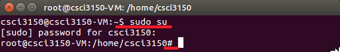

[Back to Top](#top)

### File transfer
#### Share folder (between VM and your computer's OS)
VirtualBox allows folder sharing between your computer and the VM. To use this function, you need to first install the "Guest Additions".

Select "Device" > "Insert Guest Additions CD image ...".

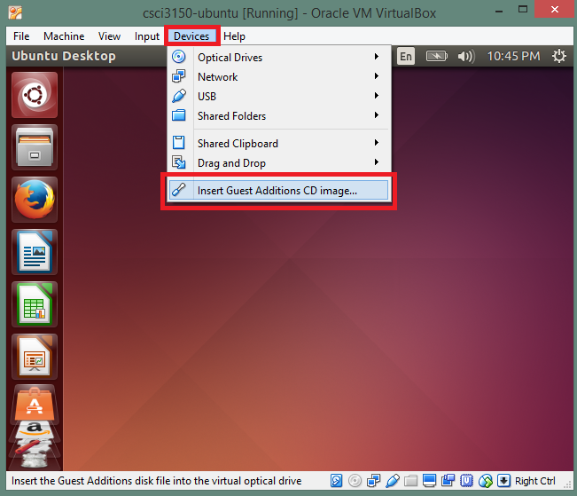

Confirm the installation by clicking "Run" in the prompt.

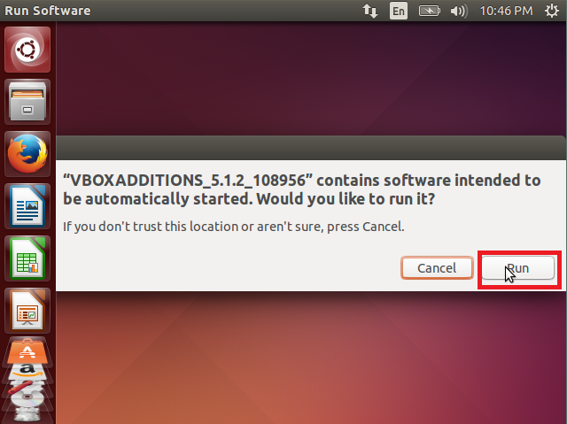

Wait until the installation completes, and press "Enter" to close the window.

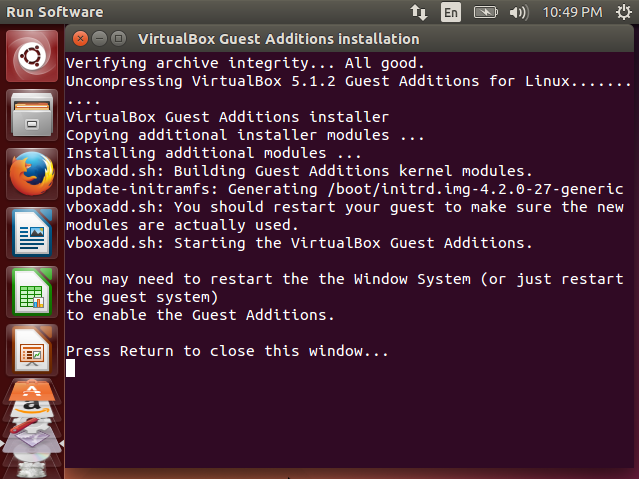

Add a new folder in the machine setting:

Select "Machine" > "Settings" > "Shared Folders". Click the "Adds new shared folder" button on the right.

Create a folder named "shared" on host OS and set it as a shared folder named "shared" for the VM. **Remember to check both "Auto-mount" and "Make Persistent".**

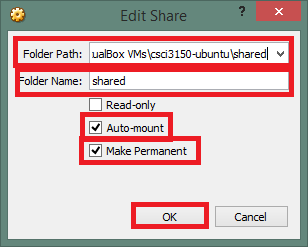

After adding the folder, you shall see an entry added to the list of shared folders. Click "OK" to confirm.

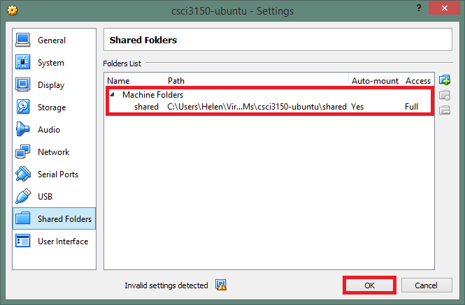

Back to the VM, add "csci3150" to the group "vboxsf" by executing the following command in a terminal.

`$ sudo usermod -a -G vboxsf csci3150`

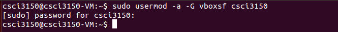

Reboot the VM. VirtualBox will then automatically mount the shared folder inside the VM for you upon boot.

After the machine reboots, open a terminal and execute the following command to check if the folder is mount .

`$ mount`

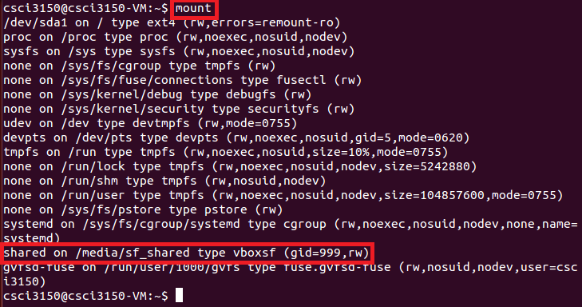

You shall found the line, `shared on /media/sf_shared type vboxsf (gid=999,rw)`, which tells you that the shared folder is mounted on the local folder `/media/sf_shared`.

Let try using the shared folder by creating an empty document in the folder on the host OS, e.g. "hello.txt". After creating the file, your shall see the file inside your VM.

Then, write some content to "hello.txt" in VM using any text editor, e.g. `nano` (save by pressing "Ctrl"+"x" followed by "Y", and press "Enter").

Check if the new content is reflected on the host OS.

[Back to Top](#top)

### Package installation
Ubuntu uses [APT](https://help.ubuntu.com/community/AptGet/Howto) to manage packages. It automatically resolves and installs dependencies when a new package needs to be installed.

To install a package, e.g. "vim", type `$ sudo apt-get install vim`. Type "Y" to confirm the installation.

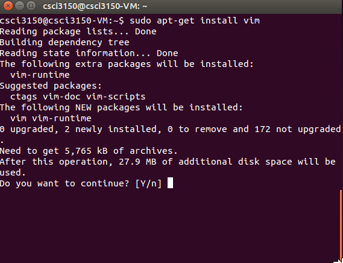

The GUI of APT is "Ubuntu Software Center".

For packages available on web in `.deb`, you can always download them and double-click to install.

**Beware that this VM runs on a 32-bit OS, which is corresponds to the architecture "i386". Choose packages built for the "i386" architecture, otherwise they won't install.**

[Back to Top](#top)

### Command Manual
It is a good habit to understand commands by looking into their manual page, e.g. find out the usage and options available for listing a directory, `$ man ls`.

[Back to Top](#top)

## More about VirtualBox
### Turning the screen resolution of your VM
Coding on a screen with low resolution, e.g. 640 x 480, can be painful... Fortunately, VirtualBox VMs are able to adjust their screen resolution according to the window size after installing the "Guest Additions".

Follow the steps to install "Guest Additions" in the Shared folder section (if you haven't do so). Reboot the VM after installation, and try resizing the VM's window to a customized size :)

[Back to Top](#top)

## References
### Official guide on Ubuntu Desktop
An easy and rich guide to the basics of Ubuntu Desktop: https://help.ubuntu.com/14.04/ubuntu-help/index.html

### Workaround for frequent error reporting popups
In a terminal,

`$ sudo rm /var/crash/*`

(Reference: [Online forum post](http://askubuntu.com/questions/133385/getting-system-program-problem-detected-pops-up-regularly-after-upgrade/369297))

### More on virtual machines
#### How to create a VirtualBox VM from scratch:
You may refer to the guide from VirtualBox: https://www.virtualbox.org/manual/ch01.html#gui-createvm

#### Alternative(s) to VirtualBox
There are other alternatives for hosting VMs on your own computer, e.g. [VMware](http://www.vmware.com/products/player.htm). The [VMware workstation player](https://my.vmware.com/en/web/vmware/free#desktop_end_user_computing/vmware_workstation_player/12_0) is free for download, however, it only runs on Windows and Linux.

#### Running 64-bit virtual machines
If you want to create your own VM and install a 64-bit OS, you will need to enable the feature in the BIOS, namely VT-x for Intel processors, or AMD-v for AMD processors
  - [Enable VT-x or AMD-v in BIOS setting](https://access.redhat.com/documentation/en-US/Red_Hat_Enterprise_Linux/6/html/Virtualization_Administration_Guide/sect-Virtualization-Troubleshooting-Enabling_Intel_VT_and_AMD_V_virtualization_hardware_extensions_in_BIOS.html)
  - [Checklist on settings (if enabling VT-x or AMD-v along does not work)]( https://forums.virtualbox.org/viewtopic.php?f=1&t=62339)

[Back to Top](#top)
