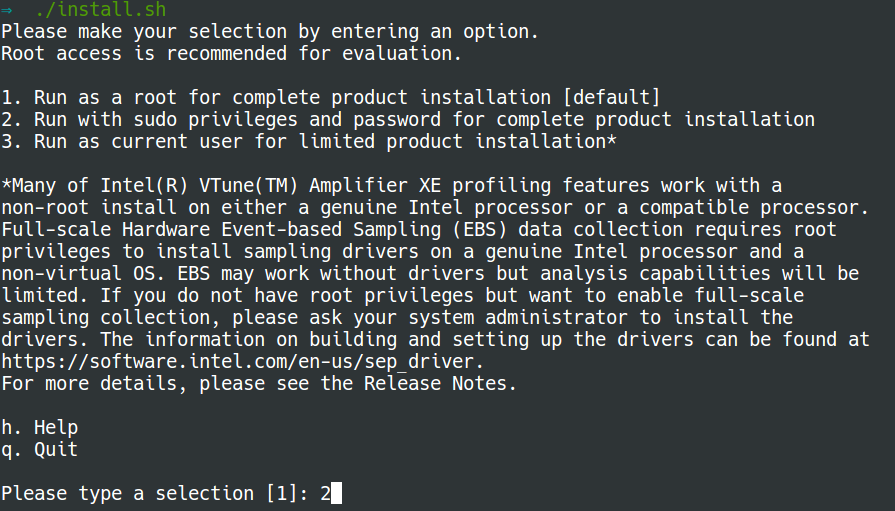
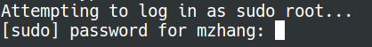
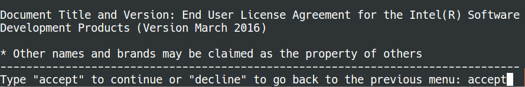
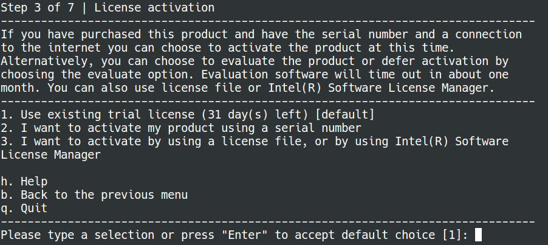
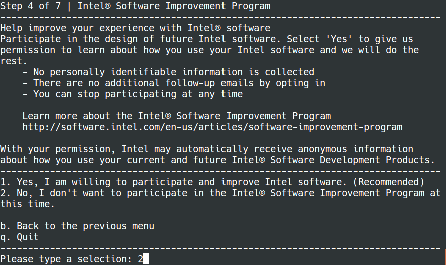
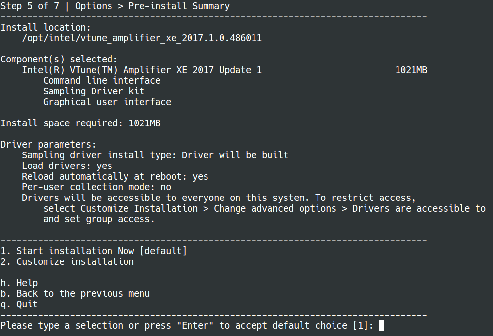
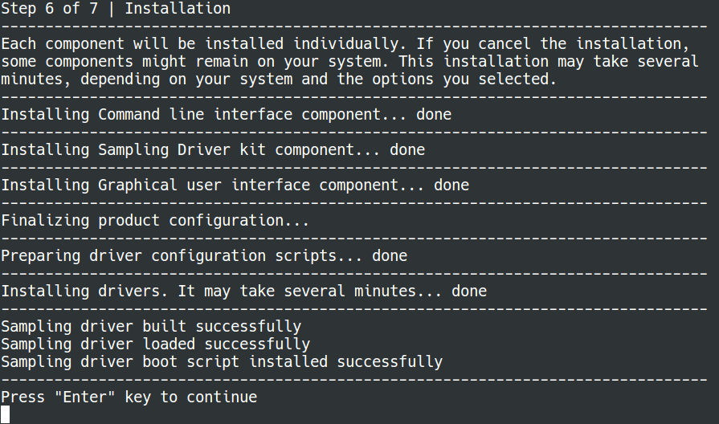
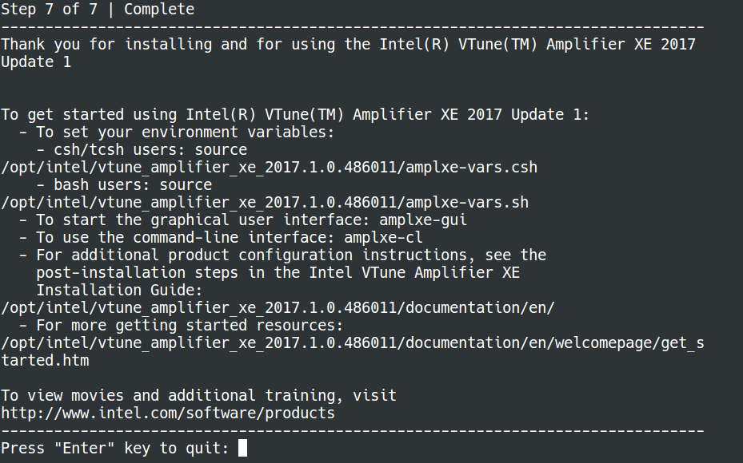
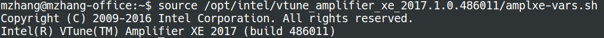

# Install VTune Amplifier

### Download

Please go to
[Free Tools for Studens](https://software.intel.com/en-us/qualify-for-free-software/student) to download VTune™ Amplifier performance profiler. Please find **Intel® Parallel Studio XE Cluster Edition (includes Fortran and C/C++)** and click on `Linux`.

Then we go to another web `Student Program`. Please tick all the items and
click `accept`.


### Installation
First of all, decompress the downloaded `tgz` file:
```bash
$ tar -zxvf parallel_studio_xe_2017_update1_cluster_edition_online.tgz
```

Now we use the command line installer to install VTune Amplifier on a 32-bit
operating system.

```bash
$ ./install.sh
```



Please enter your **password** (what you typed will not be shown on the
screen):



Now we start the installation step by step:

**Step 1**: press "**Enter**" key to continue


**Step 2**: press "space" to reach the end of the document and type "**accept**"



**Step 3**: press "**Enter**" key to accept the default choice



**Step 4**: type a selection "**2**"



**Step 5**: press "**Enter**" key to accept the default choice



**Step 6**: wait for a moment because it takes for a while. Press
"**Enter**" key
to continue



**Step 7**: press "**Enter**" key to quit as we complete the installation



After the installation succeeds, run the following command to establish the
VTune Amplifier XE environment:
* bash users: `source <install_dir>/amplxe-vars.sh`
* csh/tcsh users: `source <install_dir>/amplxe-vars.csh`

By default, the `<install_dir>` is:
* For root users: `/opt/intel/vtune_amplifier_xe_2017`
* For non-root users: `$HOME/intel/vtune_amplifier_xe_2017`

Based on our installation choice, **`<install_dir>`** is `source
/opt/intel/vtune_amplifier_xe_2017.1.0.486011`. Please run the following
command:

```bash
$ source /opt/intel/vtune_amplifier_xe_2017.1.0.486011/amplxe-vars.sh
```



