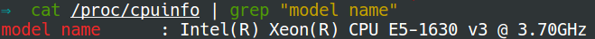

# Start VTune Amplifier

Now let us measure cache misses and TLB misses using VTune Amplifier.

**Step 1**: **identify the processor's type** using command `cat
/proc/cpuinfo | grep "model name"`. According to the output, please seclect the
right type on [**Tuning
Guides**](https://software.intel.com/en-us/articles/processor-specific-performance-analysis-papers).
For example, the below picture shows the type of my processor. So I choose
"Intel® Xeon® Processor E5 v3 Family".

**Step 2**: **set `/proc/sys/kernel/yama/ptrace_scope` to 0**. This enables the
VTune to collect data.
[*Here*](ihttp://askubuntu.com/questions/146160/what-is-the-ptrace-scope-workaround-for-wine-programs-and-are-there-any-risks)
briefly descripes the risk if we do this. We could use `vim` to edit `/proc/sys/kernel/yama/ptrace_scope`. 

*Reference*:
1. Information about using Intel VTune Amplifier XE after installing the
product is available from the **Getting
Started** page, which is available from the following location: `<install-dir>/documentation/<language>/
welcomepage/get_started.htm`. Note that `<install_dir>` is `source
/opt/intel/vtune_amplifier_xe_2017.1.0.486011` as we mentioned in the
`installation` part.

2. Check `<install-dir>/documentation/<language>/help/index.htm` to do
   performance analysis in detail.
