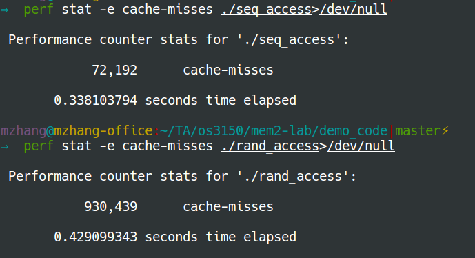
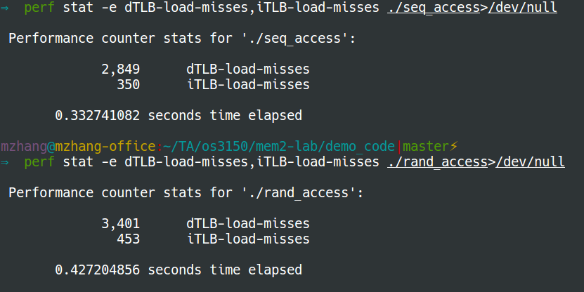

## Differences between sequential access and random access

### Cache misses
We use the following command to measure cache misses:
```bash
$ perf stat -e cache-misses ./seq_access>/dev/null
$ perf stat -e cache-misses ./rand_access>/dev/null
```

### TLB misses
We collect TLB misses using the following command:
```bash
$ perf stat -e dTLB-load-misses,iTLB-load-misses ./seq_access>/dev/null
$ perf stat -e dTLB-load-misses,iTLB-load-misses ./rand_access>/dev/null
```

