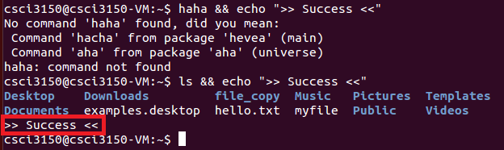
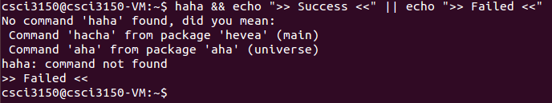
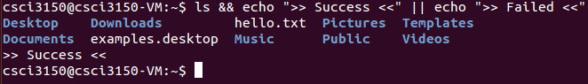
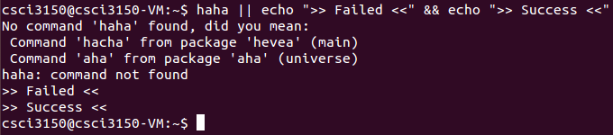
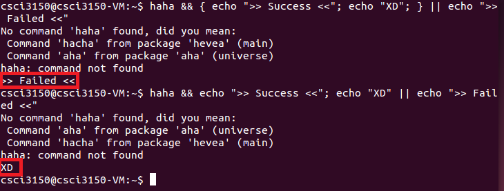

<a name="top"></a>
# Basics on Bash Operators, and C program Compilation
In this lab, we will go through
  - Selected environment variables
  - Some useful Bash commands
  - Useful operators for Bash commands
  - Basic steps to compile C programs using `gcc` and `make`

## Content
  1. [Selected environment variables](#bash)
     - [Type of shell in-use](#SHELL)
     - [Home directory and working directory](#HOME)
     - [Path to search for executables](#PATH)
  2. [Selected Bash Commands](#commands)
     - [Repeater, `echo`](#echo)
     - [Task manager, `top`/`htop`](#task)
     - [Basic operations on files](#operations)
       - [Determine file type](#type)
       - [Showing file content](#show)
       - [Searching file content](#search)
  3. [Useful operators for Bash commands](#operators)
     - [Ampersand, `&`](#ampersand)
     - [Not, `!`](#not)
     - [Pipe, `|`](#pipe)
     - [Output redirect, `>`](#redirect)
     - [Semi-colon, `;`](#semicolon)
     - [AND, `&&`](#and)
     - [OR, `||`](#or)
     - [Conditional command execution using `&&` and `||`](#combine)
     - [Command combination, `{}`](#group)
  4. [Basics on C program compilation](#compile)
     - ["Hello World" Example](#helloworld)
     - [Makefile](#makefile)
  5. [Reference](#reference)
  6. [Extra](#extra)

<a name="bash"></a>
## Selected Environment variables
<a name="SHELL"></a>
### Type of shell in-use
In UNIX there are two major types of shells: The Bourne shell and C shell.  We can find the type of shell in-use in a terminal in the environment variable `SHELL`.

`$ echo $SHELL`

In our course VM, the output is `/bin/bash`, which is the  *path*  to the shell executable.

A *path* can be *absolute*, i.e., starting from the *root*  of the file system ( e.g. `/home/csci3150`) or *relative*, i.e., starting from the current directory (`.`) (we can  list the current directory with `ls ./` and the parent directory with `ls ../`).

[(Back to top)](#top)

<a name="HOME"></a>
### Home directory and working directory

Every time the terminal is opened, we land on the *home directory*, which is stored in the variable `HOME`.

`$ echo $HOME`

When you navigate among folders, the absolute path to the current *working directory* is always stored in `PWD`.

[(Back to top)](#top)

<a name="PATH"></a>
### Path to search for executables

When you execute a command from the terminal, e.g. `ls`, the shell first looks into the directories stored in `PATH` sequentially for the first executable named `ls`. It then runs the executable. The value of `PATH` can be shown by executing,

`$ echo $PATH`

and in the course VM, you get the following sequence of folders

`/home/csci3150/bin:/home/csci3150/.local/bin:/usr/local/sbin:/usr/local/bin:/usr/sbin:/usr/bin:/sbin:/bin:/usr/games:/usr/local/games:/snap/bin`

with each of them separated by a colon `:`. Users can run executables under these directories without specifying the path to these executables.

On the other hand, users need to specify the complete path to executables that are outside these directories, e.g. to run an executable named `hello_world` under the current directory by executing `./hello_world`.

We can use the following command to add a directory to the `$PATH`.

`$ export PATH="/path/to/dir:$PATH"`

This change is temporary. If you want to make the changes permanent, you can edit `.bashrc` in your home directory and add the above command.  In practice, however, we only include a few trusted directories for better security, e.g. to avoid sproofing programs (see [the explanation from IBM](http://www.ibm.com/support/knowledgecenter/ssw_aix_71/com.ibm.aix.security/user_accounts_path_env_variable.htm)).

There are other common environment variables in Linux and users can also define their own variables using `export` (see more details [here](https://wiki.archlinux.org/index.php/environment_variables)).

[(Back to top)](#top)

<a name="commands"></a>
## Selected Bash Commands
<a name="echo"></a>
### Repeater, `echo`
`echo` simply repeats the input. Here is an example,

`$ echo "hello world"`


[(Back to top)](#top)

<a name="task"></a>
### Task manager, `top` / `htop`
`top` is a built-in command line task manager which shows processes and resources utilization.

`$ top`


The first line shows the average system load in the last 1 minute, 5 minutes, and 15 minutes; the forth line reflects the utilization of physical memory.

Below the fifth line, there is a table of processes with resources utilization shown. We take the fifth process as an example and name the information shown in the columns from left to right,

- ***Process ID (PID)***: 2493
- *Run by the user*: `csci3150`
- *Scheduling priority (PR)*: 20
- *Nice value (NI)*: 0.
- *Virtual memory (VIRT)* allocated: 5436KB
- *Physical memory (RES)* allocated: 2732KB
- *Shared memory (SHR)* allocated: 2344KB
- *Status (S)*: "R", running
- *CPU usage (%CPU)*: 0.3
- *Memory usage (%MEM)*: 0.3
- *CPU time (TIME+)*: 0.01 seconds
- *Command line used to start the process (COMMAND)*: `top`

You may also refer to the [manual page of top](http://man7.org/linux/man-pages/man1/top.1.html) for details on the information shown.

To close the task manager, simply press `q`.

Besides `top`, you may install and use a more colorful task manager, `htop`.

To install `htop`,

`$ sudo apt-get -y install htop`

(The `-y` option means automatically answer "Yes" for question asked)

Try calling `htop` in a terminal,

`$ htop`


Same as `top`, it can be close by pressing `q`.

[(Back to top)](#top)

<a name="operations"></a>
### Basic operations on files
<a name="type"></a>
#### Determine file type, `file`
`file` tries to identify the type of files using three different methods (see [its manual page for details](http://man7.org/linux/man-pages/man1/file.1.html)). For example, to determine the file type of `/bin/bash`, execute

`$ file /bin/bash`

and `file` reports `/bin/bash` is an 32-bit executable.

<a name="show"></a>
#### Showing file content, `cat` / `more` / `less` / `head` / `tail`
`cat`, `more`, `less`, `head`, and `tail` are commonly used commands for showing file content in a terminal, i.e., printing files' content to the terminal.

`cat` concatenates files and prints all content to the terminal at once. For example, to print the content of a file named `hello.txt`,

`$ cat hello.txt`


`more` and `less` are two other commands that do a similar job as `cat`. Instead of printing all content at once, `more` and `less` divide and print one screen at a time.

`head` prints a certain numbers of lines, 10 by default, from the beginning of a file. The number of printed lines can be controlled via the option `-n`, e.g. to print only the first 2 lines of `hello.txt`,

`$ head -n 2 hello.txt`


`tail` is almost the same as `head`, except that it counts lines from the end of a file.

You may refer to the online post [here](https://2buntu.com/articles/1491/viewing-text-files-on-linux-cat-head-tail-more-and-less/) for more details and examples on these commands.

[(Back to top)](#top)

<a name="search"></a>
### Searching file content, `grep`
`grep` searches files and prints the lines in which keywords are found, with keywords highlighted.


To search a phrase with one or more words, embrace the phrase with double quotes (`""`).

We can  search many files at the same time, e.g. `grep hello hello1.txt hello2.txt hello3.txt `.

Besides, `grep` supports regular expressions (regex) besides keywords in plaintext, and you may refer to [this guide](https://www.gnu.org/software/findutils/manual/html_node/find_html/grep-regular-expression-syntax.html) for more details on the use of regex for `grep`. Beware that the syntax for regex may differ among commands, i.e., the one works for `grep` may or may not work for other commands.

[(Back to top)](#top)

<a name="operators"></a>
## Useful Operators for Bash Commands
Below are some useful operators in Bash with simple examples of their usage.

<a name="ampersand"></a>
### Ampersand Operator (`&`)
Adding `&` at the end of a command allows you to start a process in background, e.g. to start and run a task manager in background,

`$ htop &`


The command returns the number of processes currently in background inside the square barracks (`[]`), followed by the id of the last process put into background.

To bring the last "background-ed" process foreground, execute

`$ fg`

[(Back to top)](#top)

<a name="not"></a>
### NOT Operator (`!`)
The NOT operator `!` allows you specify exceptions when running a command. Let try to understand it via an example.

First, create a folder `test`

`$ mkdir test`

Then, we move into the folder `test` and create some files under this folder

`$ cd test`

`$ touch a b a.txt b.txt`

By default, `$ ls` shows the four files we created under the folder `test`. To show files except those ended with the extension `.txt`, we may use

`$ ls !(*.txt)`

Note that `*` represents any number of characters, and is known as one of the *wild characters* (see the [documentation](http://tldp.org/LDP/GNU-Linux-Tools-Summary/html/x11655.htm) for more details).


[(Back to top)](#top)

<a name="pipe"></a>
### Pipe Operator (`|`)
By putting `|` between 2 commands, the output of the first command is *piped* to the second command as its input, e.g. to show the name of files with keyword `D` after listing the current directory,

`$ ls -1 | grep "D"`


*pipe* ensures that data
  - flows in one-way and,
  - is output in the order of input, i.e. first-in-first-out

(see more details on pipe [here](http://www.tldp.org/LDP/lpg/node10.html)).

[(Back to top)](#top)

<a name="redirect"></a>
### Output Redirect Operator (`>`)

Adding a `>` to the end of a command, followed by a file name, redirects the *standard output stream (`stdout`)* ([What are standard streams](https://en.wikipedia.org/wiki/Standard_streams#Standard_output_.28stdout.29)?) to a file, i.e. the output is written to the file instead of the terminal , e.g.

`$ ls >ls.out`


The output of `ls` written to the file `ls.out` instead of the terminal. You may recap the output by executing `$ cat ls.out`.

However, errors are usually output to the *standard error stream (`stderr`)* instead of `stdout`. To redirect `stderr`, we should specify its *file descriptor*, which is `2`, explicitly before `>`, e.g.

`$ haha 2>haha.err`


The error message is then written to the file `haha.err`, instead of the terminal.

[(Back to top)](#top)

<a name="semicolon"></a>
### Semi-colon Operator (`;`)
To run multiple commands in series, you may chain up the commands with semi-colons (`;`). The `;` operator marks the end of each command in a series of commands. For example, to create a file `myfile`, copy it as `myfile_copy`, create a folder `file_copy`, and move the copied file into the folder,

`$ touch myfile; cp myfile myfile_copy; mkdir file_copy; mv myfile_copy file_copy/`

Note that the command is in one single line (although it may overflow in the html display).

[(Back to top)](#top)

<a name="and"></a>
### AND Operator (`&&`)
If we replace `;` with `&&` between two commands, the second command only runs if the first command succeeds, i.e., the first command exits with status 0 [(more on exit status of Bash commands)](http://tldp.org/LDP/abs/html/exit-status.html). For example,

(1) `$ ls && echo ">> Success <<"`

vs.

(2) `$ haha && echo ">> Success <<"`



Since `ls` is a valid command but `haha` is not, `echo ">> Success <<"` runs in (1), but not (2).

[(Back to top)](#top)

<a name="or"></a>
### OR Operator (`||`)
Opposite to `&&`, if `||` is used between two commands, the second command only runs if the first command fails, i.e., the first command exits with a non-zero status. For example,

(1) `$ haha || echo ">> Failed <<"`

vs.

(2) `$ ls || echo ">> Failed <<"`


Since `haha` is an invalid command but `ls` is a valid one, `echo ">> Failed <<"` runs in (1), but not (2).

[(Back to top)](#top)

<a name="combine"></a>
### Conditional Command Execution using AND Operator (`&&`) and OR Operator (`||`) together
`&&` and `||` complement each other. We may achieve similar (but not always the same) outcome as if using `if ... then ... else ...`.

For example,

(1) `$ haha && echo ">> Success <<" || echo ">> Failed <<"`



Since `haha` is an invalid command, `echo ">> Success <<"` is skipped, but `echo ">> Failed <<"` runs.

On the other hand, for

(2) `$ ls && echo ">> Success <<" || echo ">> Failed <<"`



since `ls` runs successfully, `echo ">> Success <<"` runs. **Then, since `echo ">> Success <<"` also runs successfully, `echo ">> Failed <<"` is skipped.**

[Pitfall] By reordering (1) a bit,

(3) `$ haha  || echo ">> Failed <<" && echo ">> Success <<"`



we see that **both `&&` and `||` have the same precedence and are evaluated from left to right (see the guide [here](http://tldp.org/LDP/abs/html/opprecedence.html)).** Hence, `echo ">> Failed <<"` runs because `haha` fails, and `echo ">> Success <<"` runs because `echo ">> Failed <<"` succeeds.

[(Back to top)](#top)

<a name="group"></a>
### Command Combination Operator (`{}`)
By putting multiple commands within a `{}`, the commands are run (or not run) as a whole. For example, to print both ">> Success <<" and "XD" if the first command succeeds, and ">> Failed <<" otherwise, we should group the first two `echo`s with `{}`,

`$ haha && { echo ">> Success <<"; echo "XD"; } || echo ">> Failed <<"`

Without `{}`,

`$ haha && echo ">> Success <<"; echo "XD" || echo ">> Failed <<"`

`haha && echo ">> Success <<"` is treated as the first sequence of commands, while `echo "XD" || echo ">> Failed <<"` is another. Therefore, `echo ">> Success <<"` is skipped when `haha` fails, but `echo "XD"` runs.



[(Back to top)](#top)

<a name="compile"></a>
## Basics on C program Compilation
<a name="helloworld"></a>
### A Review on the Hello World Example
Let's briefly review how to compile a C program using the "hello world" example,

First, create a file named ['hello.c'](code/hello.c) with the following C source code,

```c

#include <stdio.h> // printf()

int main(int argc, char** argv) {
  printf("hello world!\n");
  return 0;
}

```

Then, compile the code using `gcc` in a terminal under the folder where `hello.c` locates by

```
$ gcc -c -o hello.o hello.c
$ gcc -o hello hello.o
```

We first compile the object `hello.o` using `hello.c` as the input in the first command. Then, we compile the executable `hello` using `hello.o` as the input in the second command.

Run the program by

`$ ./hello`

And you will get "`hello world!`" printed to the terminal.

Now we remove the executable `hello` and `hello.o` by `$ rm hello hello.o`.

<a name="makefile"></a>
### Writing a Makefile
Other than repeating the commands every time to compile our program, we may use `make` to automate the compilation. We may directly create a simple [Makefile](code/Makefile) to compile `hello` as follows:

```make

hello: hello.o
  gcc -o hello hello.o

hello.o: hello.c
  gcc -c -o hello.o hello.c

```

The first and third line are two *rules* for compilation, in the format of

`[target]: [prerequisites]`

*target* refers to the name of program to generate, and *prerequisites* refers to files required to run the rule. Hence, in this Makefile, `hello.o` is required to compile `hello`, and `hello.c` is required to compile `hello.o`.

The second and forth line are the *recipes*, which tell `make` how the targets should be compiled. A recipe may contains multiple lines, and all lines use tabs (`\t`) for indentation, instead of spaces.

Then, we can simply compile the program `hello` using the Makefile by executing

`$ make`

`$ make` recompiles the program for us whenever any of the prerequisites is updated. Otherwise, it gives the message `make: '[target]' is up to date.`.

Compiling a program is not the only thing we  want to write rules for. We also want to delete all the object files and executables so that the directory is ‘clean’. We can write the following rule for cleaning the object files and executables.

```
clean:
	rm -rf *.o
	rm -rf hello
```

Then we can simply clean them with the command `$ make clean`.

Let's further refer to the GNU manual for the basic concepts on Makefile writing.
  1. [Makefile Rules](https://www.gnu.org/software/make/manual/make.html#Rule-Introduction)
  2. [A Simple Makefile Example ](https://www.gnu.org/software/make/manual/make.html#Simple-Makefile)
  3. [How `make` processes a Makefile](https://www.gnu.org/software/make/manual/make.html#How-Make-Works)
  4. [Simplifying Makefiles with variables](https://www.gnu.org/software/make/manual/make.html#Variables-Simplify)

[(Back to top)](#top)

<a name="reference"></a>
## Reference
  - [10 Useful Chaining Operators](http://www.tecmint.com/chaining-operators-in-linux-with-practical-examples/)
    - However, some of the examples do not work as expected...
  - Compiling C++ source code
    - [Short introduction on the common use of `gcc` and `g++`](http://pages.cs.wisc.edu/~beechung/ref/gcc-intro.html)

[(Back to top)](#top)

<a name="extra"></a>
## Extra
### Bash Commands
  - More than searching file content: [`sed` and `awk`](http://tldp.org/LDP/abs/html/sedawk.html)

### C Program Compilation
  - [Simple Tutorial for Makefile](http://www.cs.colby.edu/maxwell/courses/tutorials/maketutor/)
  - [The complete guide to Makefile writing](http://www.gnu.org/software/make/manual/make.html)

## Interesting commands that draw in a terminal :)
  - The cow in terminal, `cowsay`
    - Install by `$ sudo apt-get -y install cowsay`
  - The train in terminal, `sl` (when you make a typo for `ls`)
    - Install by `$ sudo apt-get -y install sl`

[(Back to top)](#top)
